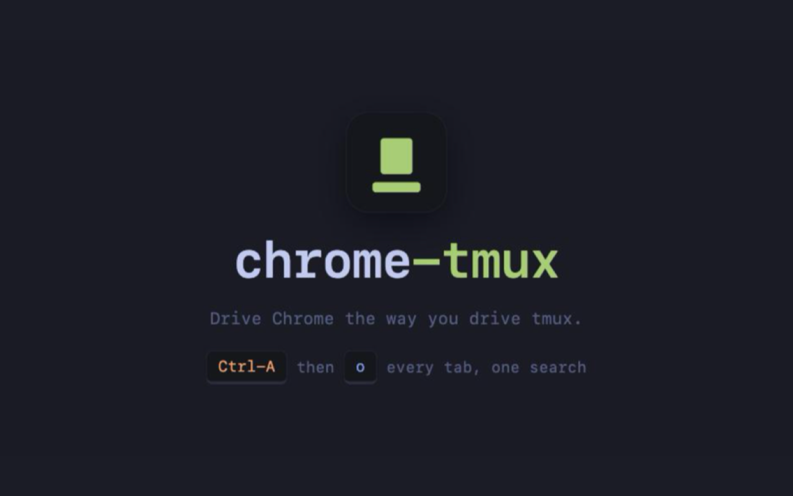
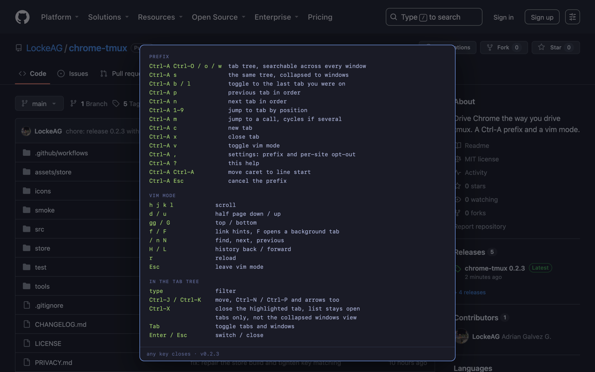
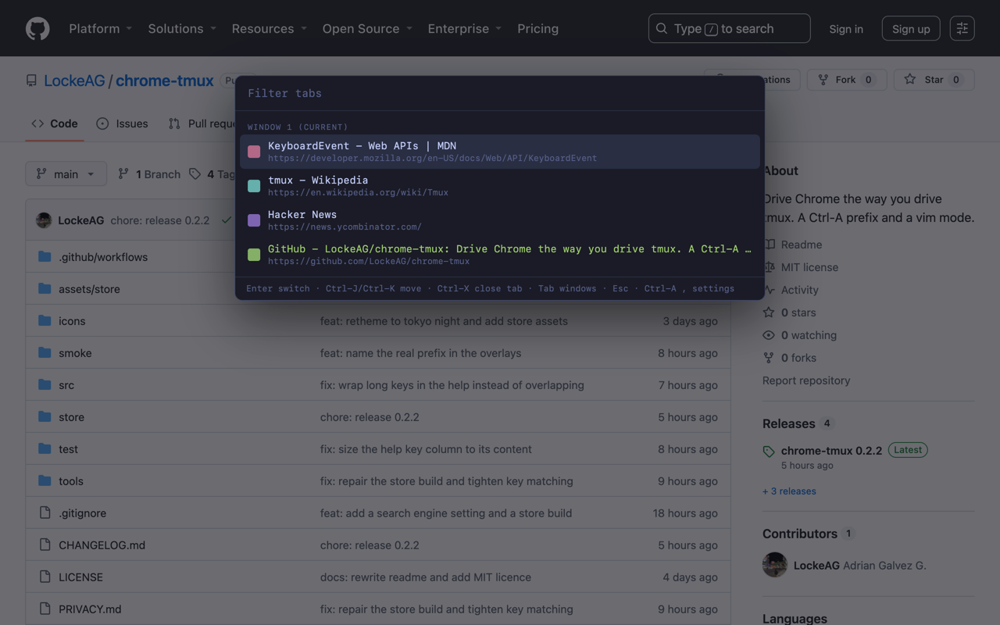

# chrome-tmux



Drive Chrome the way you drive tmux. Hit `Ctrl-A`, then a letter.

No build step, no runtime dependencies, no network calls. Chrome loads the
source as written. Types are checked with `// @ts-check` and JSDoc, so there is
nothing to compile.

**The prefix owns containers. Vim mode owns the page.** A Chrome tab is a tmux
window, a Chrome window is a tmux session, so `Ctrl-A w` lists your tabs the way
`prefix w` lists your windows.

## Install

```fish
git clone git@github.com:LockeAG/chrome-tmux.git
open -a "Google Chrome" chrome://extensions
```

Developer mode on, **Load unpacked**, pick the folder. Tabs you already had open
start working straight away.

## What it looks like





## Prefix

Press `Ctrl-A`, let go, then one of these. `-- PREFIX --` shows bottom-left while
it waits. No timeout, same as tmux.

| Key | What it does |
| --- | --- |
| `Ctrl-O` / `o` / `w` | the tab tree, searchable across every window |
| `s` | the same tree, one row per window |
| `b` / `l` | toggle back to the last tab you were on |
| `p` / `n` | previous / next tab in order |
| `1`-`9` | jump to a tab by position |
| `m` | jump to a call, cycles if there are several |
| `c` | new tab |
| `x` | close this tab |
| `v` | vim mode on or off |
| `?` | show every key, in the page |
| `Ctrl-A` | jump the caret to the start of the line |

## Vim mode

Bare keys, no prefix. `-- VIM --` shows bottom-left. It stands aside while a
text box has focus, so typing in a search field never scrolls the page.

| Key | What it does |
| --- | --- |
| `h` `j` `k` `l` | scroll |
| `d` `u` | half a page down or up |
| `gg` `G` | top, bottom |
| `f` / `F` | link hints, `F` opens in a background tab |
| `/` `n` `N` | find, next, previous |
| `H` `L` | back, forward |
| `r` | reload |
| `Esc` | leave vim mode |

## In the tab tree

| Key | What it does |
| --- | --- |
| type | filter |
| `Ctrl-J` / `Ctrl-K` | move, `Ctrl-N` / `Ctrl-P` and arrows too |
| `Ctrl-X` | close the highlighted tab, list stays open |
| `Tab` | toggle tabs and windows |
| `Enter` `Esc` | switch / close |

Plain `j` and `k` cannot move: the filter box has focus, so they would type
letters. `Enter` on a window row brings that window forward and leaves its own
tab alone.

## Calls come first

A live call is hoisted to the top under **In a call**, tinted, with a dot that
turns green while the tab is making sound. `Ctrl-A m` skips the tree and jumps
straight there.

Recognised from the URL, so a meeting counts and a landing page does not. Meet,
Zoom, Teams, Webex, Chime, GoTo, BlueJeans, Skype, Jitsi, Around, Gather. One
array in `src/calls.js`, with a test beside it.

## The one annoying trade

This takes `Ctrl-A` everywhere in Chrome, including inside text boxes, so on
macOS you lose "jump to the start of the line". Press `Ctrl-A` twice to get it
back, like `send-prefix` in tmux. The prefix is one line in
`src/content/main.js` if the trade is not worth it.

## The new tab

Chrome forbids extensions from running on its own pages, so this brings its own
new tab: a search box and your most visited sites, with every key working.

Chrome parks the cursor in the address bar on an overridden new tab. The page
takes focus back as it loads. If one ever ignores you, click it once.

## Rough edges, honestly

- `chrome://` pages, the Web Store and the PDF viewer are dead. No way round it.
  Binding a browser-level shortcut makes it worse, not better: Chrome would then
  swallow `Ctrl-A` before any page sees it.
- Keys in the omnibox belong to Chrome, not to the page.
- No settings screen. The keymap lives in the source.
- `Ctrl-A` is select-all on Windows and Linux. This was built for macOS.
- Link hints skip iframes. Find uses `window.find`, old and unofficial.
- No counts like `3j`, no marks.
- Teams only matches its join page; it rewrites the URL once you are in a call.
- Discord and Slack are absent on purpose. A voice channel or a huddle does not
  change the URL, so any pattern would flag every channel you have open.
- `Ctrl-X` reports success as soon as Chrome accepts the close. A page that
  stops you leaving with a dialog can survive it and reappear in the list.

## Privacy and security

No network requests, no remote code, no `eval`, nothing collected. It reads tab
titles and URLs because that is what a tab switcher does, and they never leave
your browser. The interface lives in a closed shadow root, so pages cannot read
or restyle it. Full detail in [PRIVACY.md](PRIVACY.md).

Two things it does on purpose, both the result of a security audit:

- **Only real keystrokes count.** A page can dispatch keyboard events at will.
  Without an `isTrusted` check any site you visited could arm the prefix and
  close your tab or spawn tabs on its own. Synthetic events are ignored.
- **The tab list shows a colour, not a favicon.** Loading each site's real icon
  would put one request per open tab into the host page's resource timeline,
  letting the page you are on read the hostnames of every tab you have open. The
  colour is derived from the hostname, so nothing is fetched.

## Development

```fish
npm test                                           # typecheck + call URL patterns
npm run typecheck                                  # types only
node tools/make-icons.cjs icons                    # extension icons
node tools/make-store-shots.cjs <src> assets/store
node tools/make-promo.cjs <capture> assets/store
```

`tools/promo.html` is the cover art. Serve it, capture it at any size, and
`make-promo.cjs` cuts it into the cover, tile and marquee.

Capturing screenshots: a browser screenshot comes back around 1512px wide
however large the viewport is, so on a big display the interface is downscaled
to mush before anything else runs. Zoom the page first, then capture:

```js
document.documentElement.style.zoom = '3'
```

## Changelog

[CHANGELOG.md](CHANGELOG.md).

## Licence

MIT.
